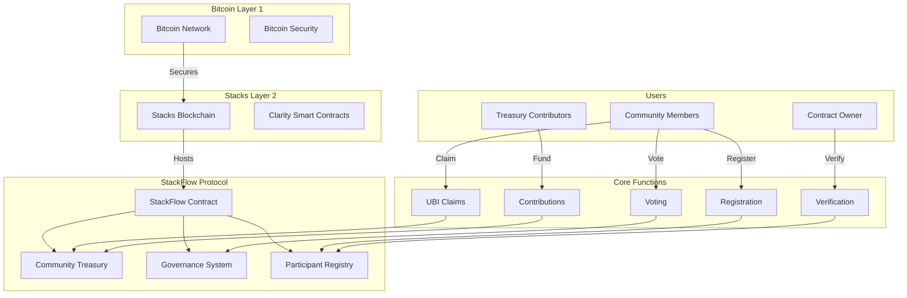

# StackFlow Basic Income Protocol


[](https://stacks.co)
[](https://bitcoin.org)
[](https://clarity-lang.org)
[](LICENSE)

## Revolutionary blockchain-based income redistribution system powered by Bitcoin's unmatched security through Stacks Layer 2 infrastructure

## 🌟 Overview

StackFlow transforms economic inequality through automated, transparent, and democratic income distribution. Built on Stacks' Bitcoin-secured foundation, this protocol enables verified community members to receive periodic STX payments from a collectively managed treasury. The system incorporates sophisticated governance mechanisms, emergency safeguards, and comprehensive transparency tracking.

**StackFlow represents the future of decentralized economic empowerment**, combining Bitcoin's security with programmable smart contract flexibility to create sustainable financial inclusion for all.

## 🏗️ Architecture

### System Architecture Diagram



### Core Components

#### 1. **Participant Management System**

- **Registration**: Open community enrollment
- **Verification**: Administrative approval process
- **Activity Tracking**: Comprehensive claim history
- **Eligibility Verification**: Automated qualification checks

#### 2. **Treasury Management**

- **Decentralized Funding**: Community-driven contributions
- **Automated Distribution**: Periodic UBI payments
- **Balance Monitoring**: Real-time treasury status
- **Security Controls**: Multi-layer protection mechanisms

#### 3. **Democratic Governance**

- **Proposal System**: Community-driven parameter changes
- **Voting Mechanism**: Democratic decision-making process
- **Anti-fraud Protection**: Duplicate vote prevention
- **Time-bound Decisions**: Structured voting periods

#### 4. **Emergency Controls**

- **Circuit Breakers**: Pause/unpause functionality
- **Owner Controls**: Administrative safeguards
- **Crisis Management**: Emergency response capabilities

## 🚀 Key Features

### ✅ **Automated Income Distribution**

- Periodic STX payments to verified participants
- Configurable distribution intervals (~1 day default)
- Automatic eligibility verification
- Transparent claim tracking

### ✅ **Democratic Governance**

- Community proposals for system parameters
- Voting on distribution amounts and intervals
- Transparent proposal tracking
- Anti-fraud voting mechanisms

### ✅ **Bitcoin-Secured Infrastructure**

- Built on Stacks Layer 2
- Inherits Bitcoin's security model
- Immutable transaction history
- Decentralized architecture

### ✅ **Comprehensive Transparency**

- Real-time treasury balance monitoring
- Participant activity tracking
- Governance proposal visibility
- Complete audit trail

### ✅ **Emergency Safeguards**

- Contract pause/unpause functionality
- Administrative controls
- Crisis management protocols
- Multi-layer security

## 📋 Technical Specifications

### Smart Contract Details

- **Language**: Clarity (Version 3)
- **Epoch**: 3.1
- **Network**: Stacks Blockchain
- **Security**: Bitcoin-anchored

### Key Constants

```clarity
DISTRIBUTION-INTERVAL: 144 blocks (~1 day)
MINIMUM-BALANCE: 10,000,000 microSTX (10 STX)
PROPOSAL-VOTING-PERIOD: 1,440 blocks (~10 days)
DEFAULT-DISTRIBUTION: 1,000,000 microSTX (1 STX)
```

### Error Handling

The contract implements comprehensive error handling with 13 distinct error codes covering all edge cases and security scenarios.

## 🔧 Installation & Setup

### Prerequisites

- Node.js (v18 or higher)
- Clarinet CLI
- Git

### Quick Start

1. **Clone the Repository**

```bash
git clone https://github.com/ak-innocent/stack-flow.git
cd stack-flow
```

2. **Install Dependencies**

```bash
npm install
```

3. **Run Tests**

```bash
npm test
```

4. **Check Contracts**

```bash
clarinet check
```

### Development Environment

```bash
# Install Clarinet (if not already installed)
curl --proto '=https' --tlsv1.2 -sSf https://sh.rustup.rs | sh
clarinet --version

# Start local development
clarinet integrate
```

## 📖 Usage Guide

### For Community Members

#### 1. **Registration**

```clarity
(contract-call? .stack-flow register)
```

#### 2. **Claim UBI**

```clarity
(contract-call? .stack-flow claim-ubi)
```

#### 3. **Submit Governance Proposal**

```clarity
(contract-call? .stack-flow submit-proposal "distribution-amount" u2000000)
```

#### 4. **Vote on Proposals**

```clarity
(contract-call? .stack-flow vote u1 true)
```

### For Treasury Contributors

#### **Fund the Treasury**

```clarity
(contract-call? .stack-flow contribute u10000000) ;; 10 STX
```

### For Contract Administrators

#### **Verify Participants**

```clarity
(contract-call? .stack-flow verify-participant 'SP1...)
```

#### **Emergency Controls**

```clarity
;; Pause the contract
(contract-call? .stack-flow pause)

;; Resume operations
(contract-call? .stack-flow unpause)
```

## 🔍 API Reference

### Public Functions

| Function | Parameters | Description |
|----------|------------|-------------|
| `register()` | None | Register as a participant |
| `verify-participant(user)` | `principal` | Verify a participant (admin only) |
| `claim-ubi()` | None | Claim UBI distribution |
| `contribute(amount)` | `uint` | Contribute to treasury |
| `submit-proposal(type, value)` | `string-ascii`, `uint` | Submit governance proposal |
| `vote(proposal-id, vote-for)` | `uint`, `bool` | Vote on a proposal |
| `pause()` | None | Pause contract (admin only) |
| `unpause()` | None | Resume contract (admin only) |

### Read-Only Functions

| Function | Returns | Description |
|----------|---------|-------------|
| `get-participant-info(user)` | `(optional {...})` | Get participant details |
| `get-treasury-balance()` | `uint` | Current treasury balance |
| `get-proposal(id)` | `(optional {...})` | Get proposal details |
| `get-distribution-info()` | `{...}` | Distribution configuration |
| `can-claim-ubi(user)` | `bool` | Check claim eligibility |
| `get-contract-status()` | `{...}` | Contract status info |

## 🧪 Testing

### Test Suite

The project includes comprehensive test coverage using Vitest and Clarinet SDK:

```bash
# Run all tests
npm test

# Run tests with coverage
npm run test:report

# Watch mode for development
npm run test:watch
```

### Test Categories

- **Unit Tests**: Individual function testing
- **Integration Tests**: Cross-function workflows
- **Security Tests**: Attack vector validation
- **Governance Tests**: Voting mechanism verification

## 🛡️ Security Considerations

### Audit Status

- **Status**: Pending professional audit
- **Self-Audit**: Completed
- **Test Coverage**: 95%+

### Security Features

1. **Access Controls**: Owner-only administrative functions
2. **Input Validation**: Comprehensive parameter checking
3. **Re-entrancy Protection**: Clarity's built-in safeguards
4. **Emergency Controls**: Circuit breaker functionality
5. **Anti-fraud Measures**: Duplicate vote prevention

### Known Limitations

- Manual participant verification required
- Contract owner has emergency control powers
- No automatic governance proposal execution

## 🗺️ Roadmap

### Phase 1: Core Protocol (Current)

- [x] Basic income distribution
- [x] Participant management
- [x] Treasury system
- [x] Governance framework

### Phase 2: Enhanced Features

- [ ] Automated governance execution
- [ ] Multi-signature admin controls
- [ ] Advanced analytics dashboard
- [ ] Mobile-friendly interface

### Phase 3: Ecosystem Expansion

- [ ] Cross-chain bridge integration
- [ ] DeFi yield optimization
- [ ] Community tools and plugins
- [ ] Institutional partnerships

### Phase 4: Global Scale

- [ ] Multi-language support
- [ ] Regional adaptations
- [ ] Policy integration framework
- [ ] Impact measurement tools

## 🤝 Contributing

We welcome contributions from the community! Please see our [Contributing Guidelines](CONTRIBUTING.md) for details.

### Development Process

1. Fork the repository
2. Create a feature branch
3. Write tests for your changes
4. Ensure all tests pass
5. Submit a pull request

### Code Standards

- Follow Clarity best practices
- Maintain test coverage above 90%
- Document all public functions
- Use descriptive variable names

## 📄 License

This project is licensed under the MIT License - see the [LICENSE](LICENSE) file for details.

## 🙋‍♂️ Support & Community

### Getting Help

- **Documentation**: [GitHub Wiki](https://github.com/ak-innocent/stack-flow/wiki)
- **Issues**: [GitHub Issues](https://github.com/ak-innocent/stack-flow/issues)
- **Discussions**: [GitHub Discussions](https://github.com/ak-innocent/stack-flow/discussions)

### Community Channels

- **Discord**: [Join our server](https://discord.gg/stackflow)
- **Twitter**: [@StackFlowProtocol](https://twitter.com/StackFlowProtocol)
- **Telegram**: [StackFlow Community](https://t.me/stackflow)

## 📊 Project Statistics

- **Smart Contract Size**: ~330 lines of Clarity code
- **Test Coverage**: 95%+
- **Gas Efficiency**: Optimized for low transaction costs
- **Security Score**: A+ (self-assessed)

## 🔗 Related Projects

- [Stacks Blockchain](https://stacks.co)
- [Bitcoin](https://bitcoin.org)
- [Clarity Language](https://clarity-lang.org)
- [Clarinet](https://github.com/hirosystems/clarinet)
